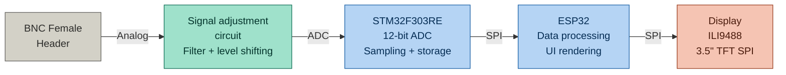
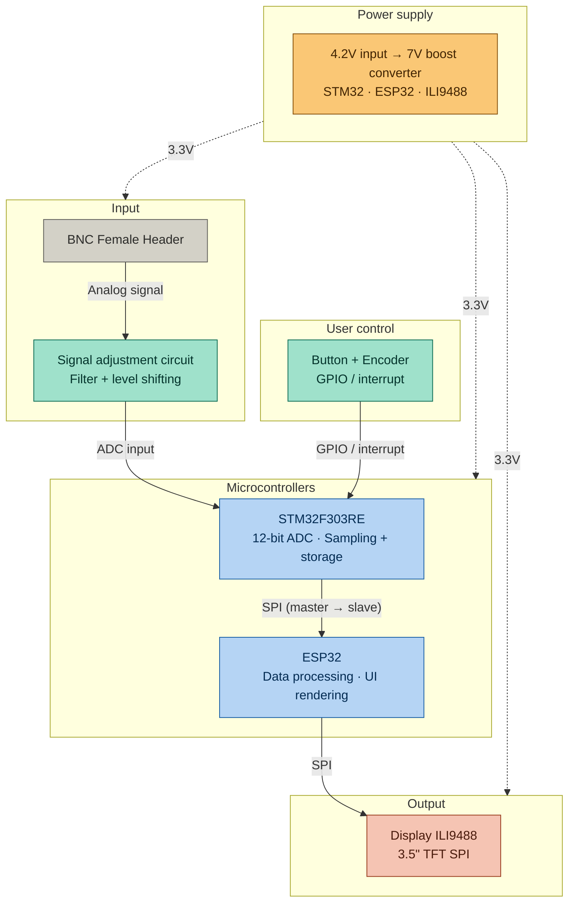

# Block Diagram – Measurement & Display System

## Hardware Block Diagram

## Full System Diagram

## Protocol Summary

| Connection | Protocol | Direction |
|---|---|---|
| BNC → Signal adjustment | Analog | → |
| Signal adjustment → STM32F303RE | ADC input | → |
| STM32F303RE → ESP32 | SPI (master → slave) | → |
| ESP32 → ILI9488 | SPI | → |
| Button / Encoder → STM32F303RE | GPIO / interrupt | → |
| Power supply → All | 7V boosted | → |
